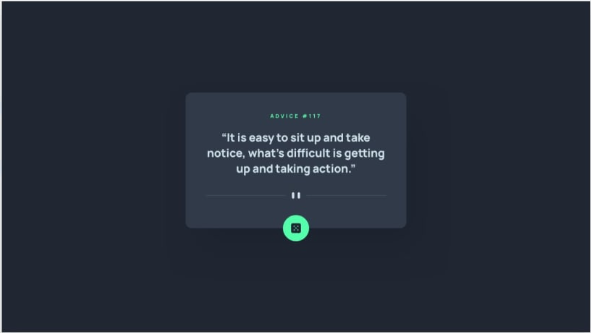
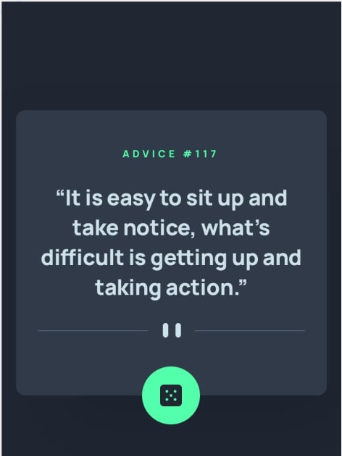
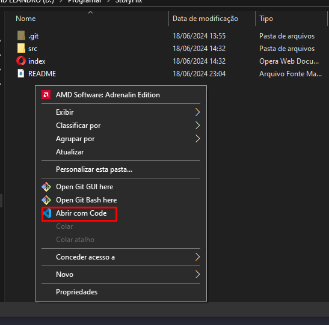

# Exercício HTML + CSS Avançado - Gerador de conselhos

**Descrição da tarefa**: Você deve criar um layout próximo desse desafio do frontend mentor: Frontend Mentor | Advice generator app coding challenge. Onde o principal desafio é construir um aplicativo que gere conselhos aleatórios. Nessa primeira etapa do exercício, será realizado apenas a construção do HTML e CSS.

Layout esperado para desktop:


Layout esperado para mobile:


## Tecnologias utilizadas
- HTML
- CSS

## Como utilizar?

1- Clone o projeto selecione a pasta aonde quer que ele fique
```
git clone url do projeto
```
2- Acesse a pasta do projeto e abra com o code (VSCode)

[]